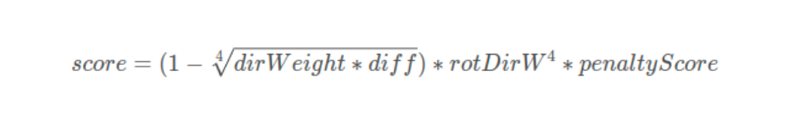

The repository is meant for leveraging system development and robot deployment for ground-based autonomous navigation and exploration. Containing a variety of simulation environments, autonomous navigation modules such as collision avoidance, terrain traversability analysis, waypoint following, etc, and a set of visualization tools, users can develop autonomous navigation systems and later on port those systems onto real robots for deployment.

Please use instructions on our [project page](https://www.cmu-exploration.com).
## [CMU团队开源自主导航和规划算法框架](https://blog.csdn.net/weixin_36773706/article/details/127305562?spm=1001.2014.3001.5502)
+ [TARE Planner安装](https://blog.csdn.net/weixin_36773706/article/details/127305562?spm=1001.2014.3001.5502#:~:text=/download_environments.sh-,TARE%20Planner%E5%AE%89%E8%A3%85,-git%20clone%20https)
+ [DSV Planner安装](https://blog.csdn.net/weixin_36773706/article/details/127305562?spm=1001.2014.3001.5502#:~:text=%E6%95%88%E6%9E%9C%EF%BC%9A-,DSV%20Planner%E5%AE%89%E8%A3%85,-%E5%AE%89%E8%A3%85%E4%BE%9D%E8%B5%96)
+ [FAR Planner安装](https://blog.csdn.net/weixin_36773706/article/details/127305562?spm=1001.2014.3001.5502#:~:text=TARE%20Planner%E7%B1%BB%E4%BC%BC-,FAR%20Planner%E5%AE%89%E8%A3%85,-git%20clone%20https)
+ [论文翻译：Autonomous Exploration Development Environment and the Planning Algorithms](https://blog.csdn.net/qq_59657502/article/details/130162346?spm=1001.2014.3001.5501)

## 1.真实机器人的话坐标系如何统一
>vehicle坐标系对应的是机器人的转向中心，
turtlebot的话对应的就是机器人的中心位置，
而一般的localization发布出来的都是传感器的位置
比如在我们的代码里面localization最后发布的是sensor的坐标，
所以只需要把localization最后发布出来的传感器坐标系加上一个x和y的偏置就可以得到vehicle坐标系了，
实际上vehicle坐标系只有local planner会用到，在local planner的launch文件里有两个参数sensorOffsetX和sensorOffsetY，这两个就是控制车辆中心和传感器中心之间的偏移量。

## 2. [Far planner 部署真实小车 & 树莓派部署lego_loam](https://blog.csdn.net/weixin_39977764/article/details/125751532?spm=1001.2014.3001.5502)
  >[far planner的输入有三个，机器人的精确位姿，当前帧点云以及地形点云，其中地形点云不是必须的，没有也可以，只是对于地面机器人效果会差一些。只要保证有这几个输入，并且对应的坐标系都是对的，那就都可以](https://bbs.csdn.net/topics/607379510?spm=1001.2014.3001.6376#:~:text=far%20planner%E7%9A%84%E8%BE%93%E5%85%A5%E6%9C%89%E4%B8%89%E4%B8%AA%EF%BC%8C%E6%9C%BA%E5%99%A8%E4%BA%BA%E7%9A%84%E7%B2%BE%E7%A1%AE%E4%BD%8D%E5%A7%BF%EF%BC%8C%E5%BD%93%E5%89%8D%E5%B8%A7%E7%82%B9%E4%BA%91%E4%BB%A5%E5%8F%8A%E5%9C%B0%E5%BD%A2%E7%82%B9%E4%BA%91%EF%BC%8C%E5%85%B6%E4%B8%AD%E5%9C%B0%E5%BD%A2%E7%82%B9%E4%BA%91%E4%B8%8D%E6%98%AF%E5%BF%85%E9%A1%BB%E7%9A%84%EF%BC%8C%E6%B2%A1%E6%9C%89%E4%B9%9F%E5%8F%AF%E4%BB%A5%EF%BC%8C%E5%8F%AA%E6%98%AF%E5%AF%B9%E4%BA%8E%E5%9C%B0%E9%9D%A2%E6%9C%BA%E5%99%A8%E4%BA%BA%E6%95%88%E6%9E%9C%E4%BC%9A%E5%B7%AE%E4%B8%80%E4%BA%9B%E3%80%82%E5%8F%AA%E8%A6%81%E4%BF%9D%E8%AF%81%E6%9C%89%E8%BF%99%E5%87%A0%E4%B8%AA%E8%BE%93%E5%85%A5%EF%BC%8C%E5%B9%B6%E4%B8%94%E5%AF%B9%E5%BA%94%E7%9A%84%E5%9D%90%E6%A0%87%E7%B3%BB%E9%83%BD%E6%98%AF%E5%AF%B9%E7%9A%84%EF%BC%8C%E9%82%A3%E5%B0%B1%E9%83%BD%E5%8F%AF%E4%BB%A5)

## 3.[底层能够处理一个带有位姿朝向的waypoint呢，需要如何修改](https://bbs.csdn.net/topics/603711745?spm=1001.2014.3001.6376)
>代码里当使用摇杆控制的时候，如果把摇杆往两侧推，车就会转向。一样的，如果希望底层能够处理带方向的waypoint，比较简单的方式是写一个类似摇杆控制器的node专门来把处理waypoint的转向，先让机器人使用现有代码到达目标点，然后再发布转向指令让机器人转到目标方向。

## 4. [local_planner的控制器怎么适用于麦阿姆轮](https://bbs.csdn.net/topics/614809677?spm=1001.2014.3001.6376)

## 5.关于  **vehicleX** **vehicleY** 参数设置
+ system_indoor.launch 
 
      将 vehicleX  vehicleY 传递给 local_planner.launch 下的goalX goalY
      表示发送给小车的初始目标位置

      将 vehicleX vehicleY 传递给 vehicle_simulator.launch 下的vehicleX vehicleX
      表示初始小车状态位置

      两者应保持一致，否则启动仿真，小车会自动启动到达goalX goalY

## 6.[local_planner 会考虑机器人的运动学约束吗](https://bbs.csdn.net/topics/606698283?spm=1001.2014.3001.6376)

+ 生成路径以及在线搜索的时候都是有考虑运动学约束的

[local planner 的论文](https://frc.ri.cmu.edu/~zhangji/publications/JFR_2020.pdf)

## 7. [local_planner对路径进行评分的公式](https://bbs.csdn.net/topics/606585543?spm=1001.2014.3001.6376)
+ dirDiff是该条路径与目标点之间的角度差值
+ rotDirW代表了该条路径的方向与当前车辆朝向的角度差
+ 
  >经验公式，在实际的应用中，这种非线性的关系效果更好

## 8.[有关处理输入的点云信息时，定义的angDiff，dirToVehicle两个参数](https://bbs.csdn.net/topics/606377207?spm=1001.2014.3001.6376)

## 9.[vehicleX和vehicleXRec这两个变量](https://bbs.csdn.net/topics/604052152?spm=1001.2014.3001.6376)
>vehicleX是当前的机器人位置，vehicleRec是接收到第一帧数据时的位置，因为后面需要使用noDataInited来辅助判断一些负障碍物，也就是没有数据的地方，需要确保是因为传感器视野限制导致没有看到数据而不是当前没有接受到数据导致的没有数据，所以需要设置vehicleRec。在每次清理地形图之后也需要重置这个参数。

## 10.[有关pathscale这个参数的含义](https://bbs.csdn.net/topics/606362350?spm=1001.2014.3001.6376)

## 11.[如何设置局部地形代价阈值的问题](https://bbs.csdn.net/topics/608107762%EF%BC%8C%E4%B9%9F%E6%98%AF%E5%89%8D%E5%90%8E%E8%A1%8C%E8%BF%9B%E7%9A%84%E6%83%85%E5%86%B5%E5%A5%BD%E5%BE%88%E5%A4%9A%E3%80%82)

## 12.[autonomous_exploration_development_environment如何导入自己学校的地图](https://bbs.csdn.net/topics/603858636)